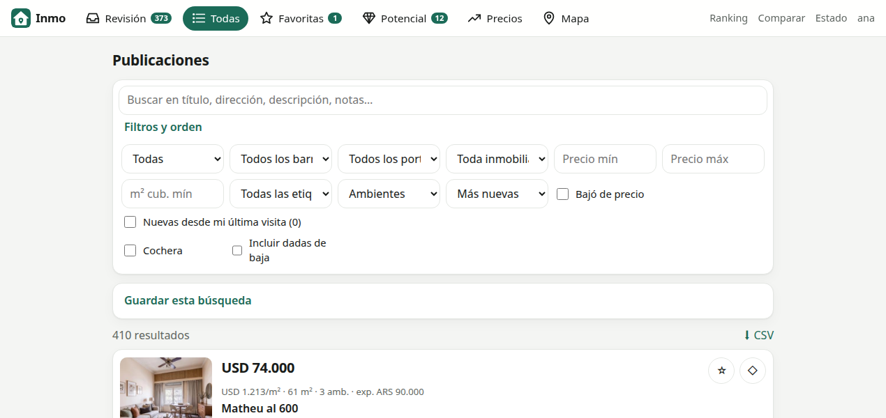
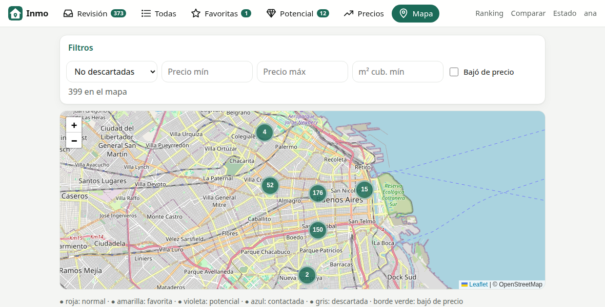
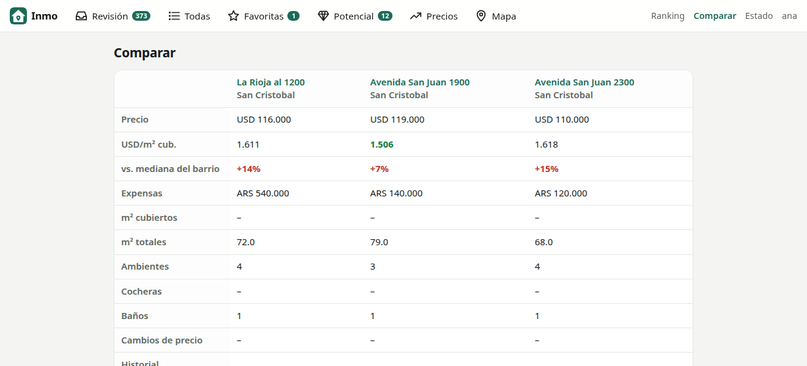
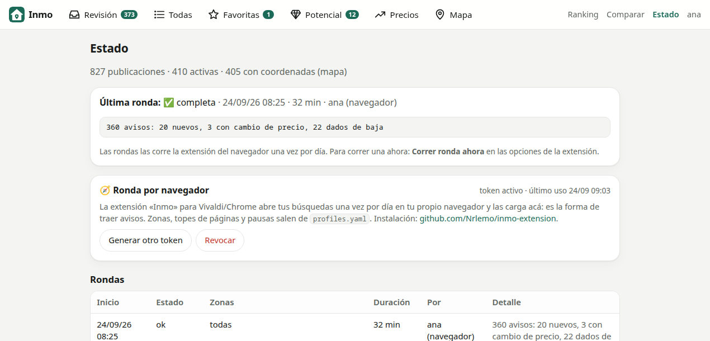

<div align="center">

# 🏠 Inmo

**Monitor personal de propiedades en venta: junta las publicaciones, detecta cambios de precio y te ayuda a decidir.**


[](https://hub.docker.com/r/nrlemo/inmo-web)
[](https://github.com/Nrlemo/inmo-android/releases/latest)

</div>

---

## ✨ Qué hace

Una **extensión del navegador** abre tus búsquedas de Zonaprop una vez por día y las carga en Inmo, que las filtra
según tus criterios y guarda todo en SQLite.
Una **web liviana**, pensada para el celular, te deja revisar, marcar, puntuar y comparar las publicaciones entre
varias personas.

| Pantalla | Para qué sirve |
|---|---|
| 📥 **Revisión** | Cola de publicaciones sin revisar, una por vez. Botones flotantes al alcance del pulgar (favorita, potencial, descartar, contactada) y gestos: **deslizar ← descarta, → pasa a la siguiente, doble toque marca potencial**. En la compu, atajos `F` `P` `D` `C` `→`. |
| 📋 **Todas** | Búsqueda de texto y filtros: barrio, portal, inmobiliaria, precio, m², ambientes, cochera, etiqueta, estado, «bajó de precio», «nuevas desde mi última visita». Búsquedas guardadas y exportación a CSV. |
| ⭐ **Favoritas** · 💎 **Potencial** | Dos listas de trabajo: las que te gustan y las que tienen potencial (para reciclar, negociar o revisar mejor). |
| 📉 **Precios** | Feed de subas y bajas con el porcentaje, y gráfico del historial en cada aviso. |
| 🗺️ **Mapa** | Todos los avisos agrupados, con filtros y colores por estado. |
| 🏆 **Ranking** | Cada persona puntúa de 1 a 5 por su cuenta; el ranking ordena por el promedio o por el puntaje de quien elijas. |
| ⚖️ **Comparar** | Avisos lado a lado, con USD/m² y la diferencia contra la mediana del barrio. |
| 🔎 **Detalle** | Vista rápida o página completa: notas, puntaje, etiquetas, historial de precio, actividad (quién hizo qué), el mismo aviso en otros portales y link al original. |
| ⚙️ **Estado** | Progreso de la ronda en curso (zona y página), cancelación, historial de rondas y consultas, y el token de la extensión. |

## 📸 Capturas

<table>
  <tr>
    <td width="50%"><br><sub><b>Todas</b> · búsqueda y filtros</sub></td>
    <td width="50%"><br><sub><b>Mapa</b> · avisos agrupados y filtros</sub></td>
  </tr>
  <tr>
    <td width="50%"><br><sub><b>Comparar</b> · USD/m² y diferencia con la mediana del barrio</sub></td>
    <td width="50%"><br><sub><b>Estado</b> · rondas y consultas</sub></td>
  </tr>
</table>

## 🏷️ Etiquetas

- **Manuales:** las que cargás vos en cada aviso (por ejemplo «ver», «llamar»).
- **Automáticas:** se asignan solas a partir de palabras clave del título y la descripción: patio, balcón, cochera,
  apto crédito, a reciclar, luminoso, contrafrente, sin ascensor, bajas expensas y muchas más. No distinguen
  mayúsculas ni tildes, y no cuentan las menciones negadas («sin cochera», «no tiene patio»). Se ven con borde
  punteado y nunca pisan las manuales.
- Tocar una etiqueta muestra todos los avisos que la tienen.

## 🧭 Cómo se traen los avisos

Con una extensión para Vivaldi/Chrome ([`inmo-extension`](https://github.com/Nrlemo/inmo-extension)): una vez por
día abre tus búsquedas en una ventana minimizada de tu propio navegador y manda cada página a Inmo. Es tu navegador
real, así que no la frena la protección anti-bots del portal. El servidor no pide páginas a los portales: sólo
decide qué página sigue y procesa lo que recibe. Se descarga desde las
[releases de inmo-extension](https://github.com/Nrlemo/inmo-extension/releases/latest) y se vincula con un token
que se genera en *Estado*.

- Recorre una búsqueda por zona y lee el listado de resultados, con todas las fotos y la ubicación de cada aviso.
- Guarda cada publicación con la fecha en que se vio por primera y última vez; si cambia el precio, lo registra en
  el historial con el porcentaje de variación.
- Da de baja los avisos que dejan de aparecer en varias rondas completas seguidas.
- Detecta la misma propiedad publicada en distintos portales (misma dirección, m² y precio aproximado) y las
  vincula.
- **Cortés con los portales:** respeta `robots.txt` (tope de páginas), hace pausas aleatorias entre páginas y
  zonas, corre una ronda por día como máximo y, si el portal muestra un bloqueo, se frena y espera 24 h.

## 👥 Varias personas

- El estado de cada aviso (favorita, potencial, descartada, contactada, notas) es compartido, y cada cambio registra
  quién lo hizo. El puntaje es de cada persona.
- **Login propio** con administración de usuarios, contraseñas con argon2id, sesiones del lado del servidor,
  protección CSRF, límite de intentos y bloqueo progresivo. Opción **«Mantener sesión iniciada»** (90 días).
- También puede delegar el login en authentik (SSO) o funcionar sin usuarios en una red privada.

## 📱 En el celular

- La web está pensada primero para el celular: navegación inferior, modo oscuro y botones grandes.
- Se puede instalar como app (PWA) desde el navegador.
- **App Android** nativa: [inmo-android](https://github.com/Nrlemo/inmo-android), con login propio y el APK en
  [Releases](https://github.com/Nrlemo/inmo-android/releases/latest).

## 🧩 Arquitectura

```
   extensión (Vivaldi/Chrome) ──▶ portales
            │  páginas del listado (/api/navegador, token)
            ▼
   ┌──────────────────────────────┐        navegador / app Android
   │  inmo-web (FastAPI)          │ ◀──────────────────────────────
   │  ronda + parsers (inmo)      │
   └──────────────┬───────────────┘
                  ▼
            ┌───────────┐
            │  SQLite   │
            └───────────┘
```

- **`scrapper/`** (paquete `inmo`): parsers por portal, la ronda por navegador (qué página sigue, pausas, bloqueos),
  historial de precios, duplicados entre portales, bajas y etiquetas automáticas.
- **`web/`**: FastAPI + Jinja2 + HTMX, sin build de JavaScript. Expone la API que usa la extensión.
- Una sola imagen Docker ([`nrlemo/inmo-web`](https://hub.docker.com/r/nrlemo/inmo-web)). La extensión se instala
  aparte, en el navegador de alguna de las personas que usan Inmo.

---

Instalación, configuración y operación: [`docs/instalacion.md`](docs/instalacion.md). Versiones y novedades:
[releases de la web](https://github.com/Nrlemo/inmo-scrapper/releases) (imagen de Docker) y
[de la extensión](https://github.com/Nrlemo/inmo-extension/releases) (`.zip`). Uso personal y de bajo volumen:
respetá los términos de cada portal.
